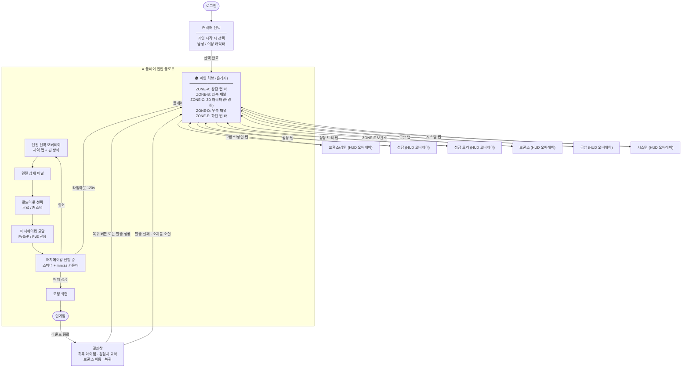
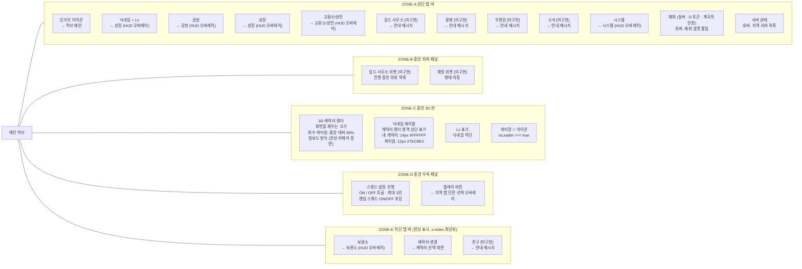
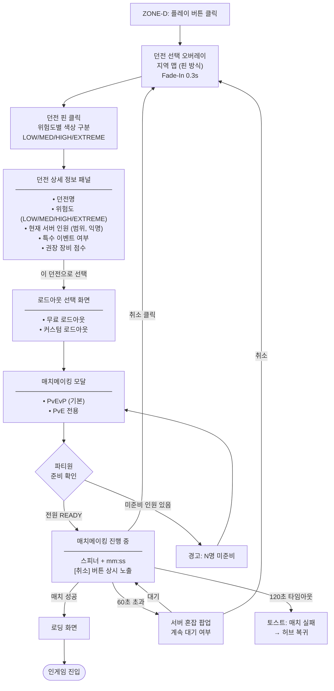
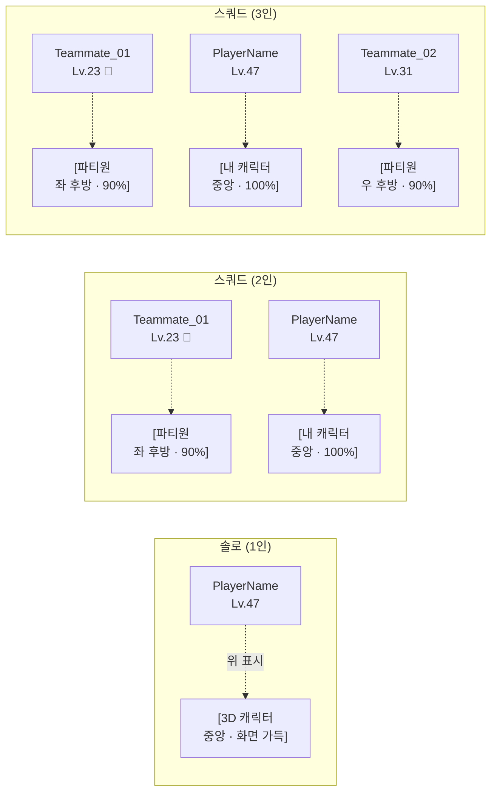
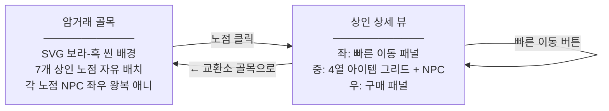
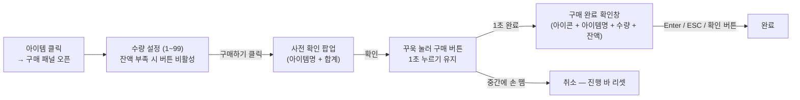
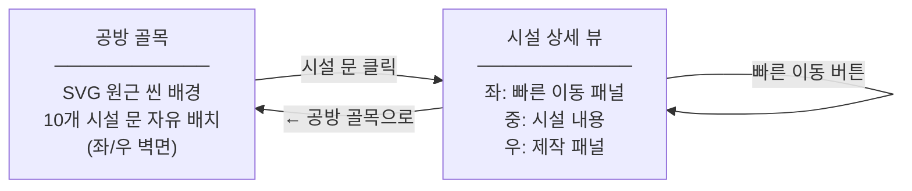
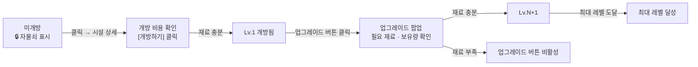
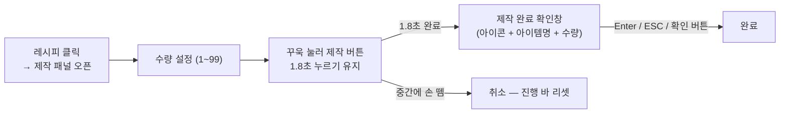
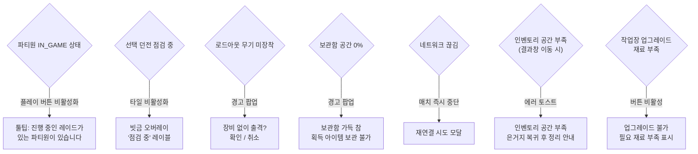

# D&E 아웃게임 구조도

> 기준일: 2026-03-12 | 기획서: `Dosc/design-spec.md`
> `[미구현]` 태그 = 현재 스프린트 미포함, UI만 배치

---

## 1. 메인 순환 루프

### HUD 오버레이 구조

메인 허브의 ZONE-C(3D 배경 씬) 위에 HUD 레이어가 오버레이됩니다. 인게임을 제외한 모든 상세 화면은 **씬 전환 없이 HUD 레이어로 표시**됩니다.

| 화면 | 진입 방법 | 구현 방식 |
|------|----------|----------|
| 교환소/상인 | ZONE-A 교환소/상인 탭 | HUD 오버레이 |
| 성장 | ZONE-A 성장 탭 | HUD 오버레이 |
| 성장 트리 | ZONE-A 성장 트리 탭 / 닉네임+Lv 클릭 | HUD 오버레이 |
| 보관소 | ZONE-E `Tab` 뱃지 + 보관소 버튼 | HUD 오버레이 |
| 공방 | ZONE-A 공방 탭 | HUD 오버레이 |
| 시스템 | ZONE-A 시스템 탭 | HUD 오버레이 |
| 인게임 | 매치 성공 후 로딩 | 씬 전환 |

HUD 탭은 서로 **직접 이동 가능** (탭 간 이동 시 허브로 복귀 없이 바로 전환)

HUD 헤더 오른쪽에 **재화 보유량(실버 · D 토큰 · 계곡의 인장) 상시 표시**, 각 재화 호버 시 설명 툴팁

---

## 2. Zone별 메뉴 세부 항목

---

## 3. 플레이 진입 서브플로우 상세

---

## 4. 스쿼드 구성 레이아웃

### 인원수별 카메라 · 씬 배치

| 상황 | 카메라 | 배경 씬 |
|------|--------|---------|
| 솔로 (1인) | 캐릭터 정면 미디엄샷, 약간 우측 오프셋 | 허브 기지 내부, 소수 NPC 배치 |
| 듀오 (2인) | 풀샷으로 줌아웃, 두 캐릭터 프레임 인 | 두 캐릭터 나란히 배치, 간격 1.2m |
| 트리오 (3인) | 풀샷 + 추가 줌아웃, 삼각 배치 | 파티장 중앙 전방, 나머지 좌우 후방 배치 |
| 로드아웃 편집 진입 | 카메라 슬로우 달리-인, 상반신 클로즈업 | 배경 블러 처리 (DOF 효과) |

---

## 5. 결과창 구조

| 항목 | 내용 |
|------|------|
| 표시 정보 | 획득 경험치 · 획득 골드 · 생존 시간 · 획득 아이템 목록 |
| 인벤토리로 이동 | 보관함의 획득 아이템을 인벤토리로 이동하는 액션 (HUD 이동 아님) |
| 인벤토리 공간 부족 시 | 이동 불가 · 에러 토스트 표시 |
| 복귀 버튼 | 허브(은거지)로 복귀 |
| 탈출 성공 | 소지품 유지 → 허브 |
| 탈출 실패 | 소지품 소실 → 허브 |

---

## 6. 보관소 HUD 패널

진입: ZONE-E 보관소 버튼 → HUD 오버레이

### 패널 구성 순서 (좌 → 우)

| 순서 | 패널 | 너비 | 설명 |
|------|------|------|------|
| 1 | 로드아웃 프리셋 | 200px | 프리셋 목록 (활성 프리셋 강조) |
| 2 | 필터링 아이콘 바 | 38px | 보관함 필터 세로 아이콘 (호버 시 라벨 우측 표시) |
| 3 | 보관함 | 270px | 기본 60칸, 확장 가능 |
| 4 | 장비 슬롯 + 소모품 슬롯 + 배낭 패널 | flex | 장비 → 소모품(4칸) → 배낭 → 안전 가방 슬롯 (세로 배치) |

### 보관함 필터링 아이콘

| 아이콘 | 구분 |
|--------|------|
| 🗂 | 전체 |
| ⚔ | 무기 |
| 🛡 | 방어구 |
| 🧪 | 소모성 |
| 📜 | 레시피 |
| 📦 | 기타 |

### 보관함 확장

| 항목 | 내용 |
|------|------|
| 기본 슬롯 | 60칸 (4열, 세로 스크롤) |
| 확장 단위 | +24칸 |
| 비용 공식 | 1,000 + (확장 횟수 × 500) 골드 |
| 골드 부족 시 | 확장하기 버튼 비활성 |

### 장비 슬롯

주무기 · 보조무기 · 헬멧 · 상의 · 하의 · 장갑 · 신발 · 목걸이 · 반지 · **배낭** (하단 단독 행)

### 배낭 패널

장비 슬롯 하단에 위치. 장착 배낭 종류에 따라 슬롯 수 변동.
패널 헤더 우측에 **모두 보관함으로 이동** 버튼 배치.

| 배낭 종류 | 그리드 | 슬롯 수 |
|----------|--------|--------|
| 기본 배낭 | 4×2 | 8칸 |
| 중형 배낭 | 4×3 | 12칸 |
| 대형 배낭 | 4×4 | 16칸 |
| 특대형 배낭 | 4×5 | 20칸 |
| 장착 없음 | — | 0칸 |

**모두 보관함으로 이동 예외 처리**

| 상황 | 처리 |
|------|------|
| 배낭 아이템 없음 | 안내 토스트 |
| 보관함 여유 부족 | 차단 + 에러 토스트 (필요/여유 칸 표시) |
| 이동 성공 | 배낭 비움 + 성공 토스트 |

**소모품 슬롯** (장비 슬롯 하단 · 4칸 고정 · 확장 여부 미결정)

**안전 가방 슬롯** (배낭 패널 하단 · 4열 그리드 기준 셀 크기)

| 배낭 종류 | 안전 가방 슬롯 |
|----------|--------------|
| 기본 배낭 | 1칸 |
| 중형 배낭 | 1칸 |
| 대형 배낭 | 2칸 |
| 특대형 배낭 | 2칸 |
| 장착 없음 | 0칸 (섹션 표시 유지) |

---

## 7. 교환소/상인 (Merchant) HUD 패널

진입: ZONE-A 교환소/상인 탭 → HUD 오버레이 (**암거래 골목 뷰 + 상인 상세 뷰** 이중 구조)

> 최종 수정: 2026-03-12 — SVG 암거래 골목 씬 + 상인 노점 자유 배치 + NPC 애니메이션

### 암거래 골목 뷰 흐름

### 상인 목록 (7개)

| 상인 | NPC | 텐트 스타일 | 배치 |
|------|-----|-----------|------|
| 잡화 상인 🛍 | 👴 | 기본 (보라 체크) | 왼쪽 top 4% |
| 특수 아이템 💎 | 🧙 | tent-special (금색) | 왼쪽 22% top 16% |
| 방어구 상인 🛡 | 💂 | tent-armor (청색) | 왼쪽 top 43% |
| 암시장 상인 💀 | 🥷 | tent-black (암적색) | 왼쪽 top 69% |
| 무기 상인 🗡 | 🪖 | tent-weapon (암적갈) | 오른쪽 top 4% |
| 소비 아이템 🧪 | 👩 | tent-consumable (녹색) | 오른쪽 top 43% |
| 마법 도구 🔮 | 🧝 | tent-magic (보라) | 오른쪽 top 69% |

### 구매 UX — 사전 확인 + Hold-to-Buy

---

## 8. 작업장 (Workshop) HUD 패널

진입: ZONE-A 공방 탭 → HUD 오버레이 (**골목 뷰 + 시설 상세 뷰** 이중 구조)

> 최종 수정: 2026-03-12 — 전면 재설계

### 골목 뷰 흐름

### 시설 목록 (10개)

| 시설 | 최대 레벨 | 기능 | 문 스타일 |
|------|----------|------|----------|
| 기본 작업대 | Lv.3 | 기초 아이템 및 부품 제작 | 기본 나무문 |
| 애완슬라임 | Lv.3 | 던전 귀환 시 자원 자동 수집 | 유기 문 |
| 무기 제작소 | Lv.5 | 무기 아이템 제작 | 철문 |
| 방어구 제작소 | Lv.5 | 방어구 아이템 제작 | 철문 |
| 연금술 실험실 | Lv.5 | 소모품 및 연금술 아이템 제작 | 비전 문 |
| 주문서 제작소 | Lv.5 | 강화·수리·속성 부여 주문서 제작 | 비전 문 |
| 땜장이 작업소 | Lv.5 | 장비 수리 및 개조 | 기본 나무문 |
| 정화의 제단 | Lv.3 | 오염 아이템 정화 · 저주 해제 | 성스러운 문 |
| 아이템 합성소 | Lv.5 | 아이템 합성으로 더 강력한 아이템 생성 | 청록 문 |
| 레시피 보관함 | 없음 | 인게임 획득 레시피 자동 보관 | 기본 나무문 |

### 시설 상태 흐름

### 제작 UX — Hold-to-Craft

---

## 9. 예외 처리 흐름

---

## [미구현] 항목 목록

| 항목 | Zone | 현재 동작 |
|------|------|----------|
| 길드 사무소 탭 | ZONE-A | 클릭 시 '구현 예정 안내' 메시지 |
| 우편함 탭 | ZONE-A / HUD 오버레이 | 클릭 시 '구현 예정 안내' 메시지 |
| 길드 사무소 위젯 | ZONE-B | UI 자리만 표시 |
| 채팅 위젯 | ZONE-B | UI 자리만 표시, 형태 미정 |
| 친구 탭 | ZONE-E | 클릭 시 '구현 예정 안내' 메시지 |
| 닉네임 빌보드 회전 | ZONE-C | 빌보드 방식 확정 — 항상 카메라 정면 고정 |

---

## 변경 이력

| 날짜 | 변경 내용 |
|------|---------|
| 2026-03-10 | 캐릭터 선택 노드 추가 (메인 허브 진입 전, 남/녀 선택) |
| 2026-03-10 | 결과창 노드 추가 (인게임 → 결과창 → 메인 허브) |
| 2026-03-10 | 지역 → 던전 명칭 일괄 변경 |
| 2026-03-10 | HUD 오버레이 구조 명시 (상인·성장·성장트리·로드아웃&장비·설정) |
| 2026-03-10 | HUD 탭 간 직접 이동 가능 명시 |
| 2026-03-10 | 탈출 성공/실패 경로 인게임 → 결과창 → 메인 허브로 분리 |
| 2026-03-10 | ZONE-C 스쿼드 인원 연동 — 스쿼드 변경 시 캐릭터 표시 동적 변경 |
| 2026-03-10 | ZONE-E 항상 표시 구조 확정 (z-index 최상위, HUD/모달 위) |
| 2026-03-10 | ZONE-E 버튼 배치 변경 — 캐릭터 변경 추가, 설정 제거 |
| 2026-03-10 | ZONE-C 닉네임/레벨 위치 — 캐릭터 렌더 영역 상단 표기로 변경 |
| 2026-03-10 | ZONE-D 랜덤 스쿼드 ON/OFF 토글 추가 |
| 2026-03-10 | ZONE-C 캐릭터 크기 확대 — 화면을 채우는 크기, 좌우 파티원 90% 비율 |
| 2026-03-10 | 던전 선택 방식 변경 — 그리드 목록 → 지역 맵 핀 방식 |
| 2026-03-10 | 인게임 화면 텍스트 — "탄약/아이템" → "아이템", "(임시 화면)" 표기 추가 |
| 2026-03-10 | 결과창 — "획득한 아이템 인벤토리로 이동" + "복귀" 버튼 추가 |
| 2026-03-10 | 결과창 — 인벤토리 공간 부족 시 이동 실패 분기 추가 |
| 2026-03-10 | 작업장 HUD 패널 추가 — 5개 시설, 개별 개방/레벨업, 재료 확인 팝업 |
| 2026-03-10 | 작업장 — 애완슬라임 귀환 자원 수집 시뮬레이션 추가 |
| 2026-03-10 | ZONE-A 버튼 추가 — 성장 트리, 로드아웃 & 장비, 설정 |
| 2026-03-10 | HUD 오버레이 — 우편함(미구현) 버튼 추가, ✕ 버튼 제거 |
| 2026-03-10 | 재화 표시 — ZONE-A / HUD 오버레이 오른쪽에 골드·크리스탈 분리 표시, 호버 툴팁 |
| 2026-03-10 | 시설 상태 표기 "미개발" → "미개방" 통일 |
| 2026-03-11 | 로드아웃 & 장비 패널 전면 재구성 — 패널 순서 변경 (프리셋→필터→보관함→장비) |
| 2026-03-11 | 보관함 — 기본 60칸(4열 그리드), 확장 기능 추가 (+24칸, 골드 비용 증가 구조) |
| 2026-03-11 | 보관함 필터링 — 세로 아이콘 바 추가 (전체/무기/방어구/소모성/레시피/기타, 호버 라벨) |
| 2026-03-11 | 로드아웃 슬롯 → 로드아웃 프리셋으로 명칭 변경 |
| 2026-03-11 | 장비 슬롯에 배낭 항목 추가 (하단 단독 행) |
| 2026-03-11 | 배낭 패널 추가 — 장비 슬롯 하단 배치, 장착 배낭 종류에 따라 그리드 동적 변경 |
| 2026-03-11 | Git 저장소 초기화 및 GitHub 업로드 — https://github.com/dla9556/DE_Hideout |
| 2026-03-11 | 로드아웃 & 장비 진입 경로 변경 — ZONE-A 탭 · HUD 탭 제거, ZONE-E 인벤토리 버튼으로 단일화 |
| 2026-03-12 | 공방 UI 전면 재설계 — 사이드바+상세패널 → SVG 원근 골목 씬 + 자유 배치 시설 문 (WF_LAYOUT, 6종 문 스타일) |
| 2026-03-12 | 제작 UX 변경 — 즉시 클릭 → 꾸욱 누르기 1.8초 hold-to-craft + 제작 완료 확인창 (Enter/ESC/버튼) |
| 2026-03-12 | 교환소/상인 UI 전면 재설계 — 암거래 골목 SVG 씬 + 자유 배치 7개 노점, 움직이는 NPC, hold-to-buy 1초 |
| 2026-03-12 | 교환소 상인 상세 뷰 레이아웃 개선 — 아이템 그리드 좌측 확대(3열), NPC 우측 대형 표시 |
| 2026-03-12 | 보관소 — 안전 가방 슬롯 추가 (배낭 패널 하단, 기본·중형 1칸 / 대형·특대형 2칸) |
| 2026-03-12 | 보관소 — 배낭 '모두 보관함으로 이동' 버튼 추가, 공간 부족 시 차단 처리 |
| 2026-03-12 | ZONE-E 보관소 버튼 — 좌측 Tab 뱃지 추가, 캐릭터 변경과 동일 너비 통일 |
